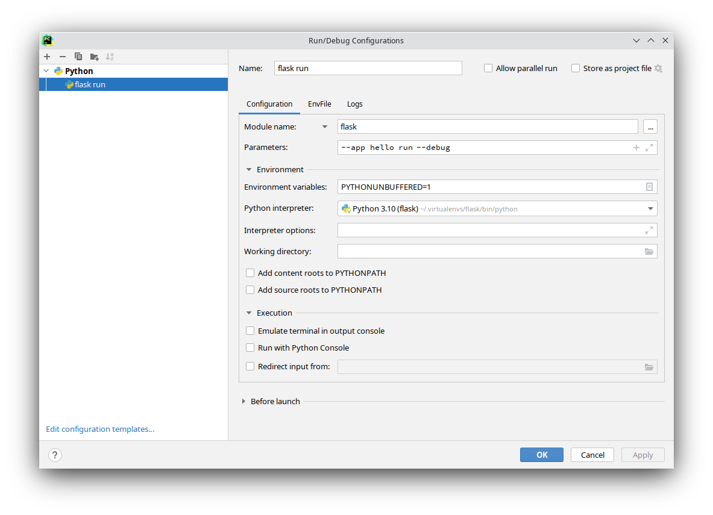

.. currentmodule:: flask

命令行接口
======================

在虚拟环境中安装 Flask 时会同时安装 ``flask`` 脚本，这是一个 `Click`_
命令行接口。在终端中执行该脚本可以操作内建的、扩展的和应用定义的命令。
关于命令的更多信息和选择可以通过使用 ``--help`` 参数查看。

.. _Click: https://click.palletsprojects.com/

探索应用
---------------------

``flask`` 命令由 Flask 安装，而不是你的应用。为了可以正常使用，它必须
被告知可以在哪里找到你的应用。 ``flask`` 命令的 ``--app`` 参数用于指
定如何载入应用。

虽然 ``--app`` 支持多种选项来定义应用，但多数情况下应该很简单。以下是
典型值：

(空)
    名称“ app ”或者“ wsgi ”被导入（作为一个“ .py ”文件或者包），
    自动探测一个应用（ ``app`` 或者 ``application`` ）或者工厂（
    ``create_app`` 或者 ``make_app`` ）。

``--app hello``
    给定的名称被导入，自动探测一个应用（ ``app`` 或者
    ``application`` ）或者工厂（ ``create_app`` 或者 ``make_app`` ）。

----

``--app`` 分三个部分：一是一个可选路径，用于设置当前工作文件夹；二是
一个 Python 文件或者带点的导入路径；三是一个可选的实例或工厂的变量名
称。如果名称是工厂，则可以选择在后面的括号中加上参数。以下演示说明：

``--app src/hello``
    设置当前工作文件夹为 ``src`` 然后导入 ``hello`` 。

``--app hello.web``
    导入路径 ``hello.web`` 。

``--app hello:app2``
    使用 ``hello`` 中的 ``app2`` Flask 实例。

``--app 'hello:create_app("dev")'``
    调用 ``hello`` 中的 ``create_app`` 工厂，把 ``'dev'`` 作为参数。

如果没有设置 ``--app`` ，命令会尝试导入“ app ”或者“ wsgi ”（可以
是一个“ .py ”文件或者包）并尝试探测一个应用实例或者工厂。

根据给定的导入，命令会寻找一个名为 ``app`` 或者 ``application`` 的应
用实例。如果找不到会继续寻找任意应用实例。如果找不到任何实例，会接着
寻找名为 ``create_app`` 或者 ``make_app`` 的函数，使用该函数返回的实
例。

如果工厂名称后面是括号，那么其中的内容会被视作为 Python 语言内容，并
用作函数的参数。这意味着字符串必须使用双引号包围。

运行开发服务器
--------------------------

:func:`run <cli.run_command>` 命令可以启动开发服务器，它在大多数情况
下替代 :meth:`Flask.run` 方法。::

    $ flask --app hello run
     * Serving Flask app "hello"
     * Running on http://127.0.0.1:5000/ (Press CTRL+C to quit)

.. warning:: 不要在生产中使用此命令运行应用，只能在开发过程中使用开发
    服务器。开发服务器只是为了提供方便，但是不够安全、稳定和高效。有
    关如何在生产中运行服务器，请参阅 :doc:`/deploying/index` 。

如果另一个程序已经占用了 5000 端口，那么当你尝试打开服务时会看到
``OSError: [Errno 98]`` 或者 ``OSError: [WinError 10013]`` 错误。
如何处理这个问题，参见 :ref:`address-already-in-use` 。

调试模式
~~~~~~~~

在调试模式下， ``flask run`` 命令会默认启用交互调试器和重载器，以方便
发现错误并进行调试。使用 ``--debug`` 选项可以启用调试模式。

.. code-block:: console

     $ flask --app hello run --debug
      * Serving Flask app "hello"
      * Debug mode: on
      * Running on http://127.0.0.1:5000/ (Press CTRL+C to quit)
      * Restarting with inotify reloader
      * Debugger is active!
      * Debugger PIN: 223-456-919

``--debug`` 选项也可以在任何命令中被传递给顶层的 ``flask`` 命令。以下
两个命令是等价的。

.. code-block:: console

    $ flask --app hello --debug run
    $ flask --app hello run --debug

使用重载器监视文件、排除文件
~~~~~~~~~~~~~~~~~~~~~~~~~~~~~~~~~~~~~~~~

在调试模式下，当你的 Python 代码或者导入的模块发生变动时会触发重载器。
使用 ``--extra-files`` 参数可以添加额外的文件，多个文件路径使用
``:`` 分隔，在 Windwos 下使用 ``;`` 分隔。

.. code-block:: text

    $ flask run --extra-files file1:dirA/file2:dirB/
     * Running on http://127.0.0.1:8000/
     * Detected change in '/path/to/file1', reloading

重载器也可以排除监视文件，使用 ``--exclude-patterns`` 可以排除文件，
这个参数使用 :mod:`fnmatch` 模式。，多个文件路径使用 ``:`` 分隔，在
Windwos 下使用 ``;`` 分隔。

打开一个 Shell
------------------------

为了探索应用中的数据，可以 :func:`shell <cli.shell_command>` 命令开启
一个交互 Python shell 。这样，一个应用情境被激活，应用实例会被导入。::

    $ flask shell
    Python 3.10.0 (default, Oct 27 2021, 06:59:51) [GCC 11.1.0] on
    linux App: example [production]
    Instance: /home/david/Projects/pallets/flask/instanc
    >>>

使用 :meth:`~Flask.shell_context_processor` 添加其他自动导入。

.. _dotenv:

通过 dotenv 设置环境变量
---------------------------------

``flask`` 支持使用环境变量来进行设置任何参数。变量的命名方式类似
``FLASK_OPTION`` 或者 ``FLASK_COMMAND_OPTION`` ，例如
``FLASK_APP`` 或者 ``FLASK_RUN_PORT`` 。

与其每次运行命令时传递参数或者环境变量，不如使用 Flask 的 dotenv 支持
功能自动设置环境变量。

如果 `python-dotenv`_ 已安装，那么运行 ``flask`` 命令就会根据 ``.env``
和 ``.flaskenv`` 文件中定义的内容来设置环境变量。你也可以使用
``--env-file`` 参数来载入其他包含配置的文件。 Dotenv 文件可以避免手动
设置 ``--app`` 或者 ``FLASK_APP`` ，并且使用环境类似于一些开发部署工
作。

命令行设置的变量会重载 :file:`.env` 中的变量， :file:`.env` 中的变量
会重载 :file:`.flaskenv` 中的变量。 :file:`.flaskenv` 应当用于公共变
量，如 ``FLASK_APP`` 而 :file:`.env` 则应用用于私有变量，并且不提交到
储存库。

为了找到定位文件，将会从运行 ``flask`` 的文件夹向上扫描文件夹。

这些文件只能由``flask``命令或调用 :meth:`~Flask.run` 加载。如果想在生
产运环境加载这些文件，你应该手动调用 :func:`~cli.load_dotenv` 。

.. _python-dotenv: https://github.com/theskumar/python-dotenv#readme

设置命令参数
~~~~~~~~~~~~~~~~~~~~~~~

Click 被配置为根据环境变量为命令选项载入缺省值。变量使用
``FLASK_COMMAND_OPTION`` 模式。例如，要为运行命令设置端口，不使用
``flask run --port 8000`` ，而是使用:

.. tabs::

   .. group-tab:: Bash

      .. code-block:: text

         $ export FLASK_RUN_PORT=8000
         $ flask run
          * Running on http://127.0.0.1:8000/

   .. group-tab:: Fish

      .. code-block:: text

         $ set -x FLASK_RUN_PORT 8000
         $ flask run
          * Running on http://127.0.0.1:8000/

   .. group-tab:: CMD

      .. code-block:: text

         > set FLASK_RUN_PORT=8000
         > flask run
          * Running on http://127.0.0.1:8000/

   .. group-tab:: Powershell

      .. code-block:: text

         > $env:FLASK_RUN_PORT = 8000
         > flask run
          * Running on http://127.0.0.1:8000/

这些可以添加到 ``.flaskenv`` 文件，就像 ``FLASK_APP`` 来控制缺省命令
选项。

禁用 dotenv
~~~~~~~~~~~~~~

如果检测到 dotenv 文件，但是没有安装 python-dotenv ，那么 ``flask``
命令会显示一个消息。

.. code-block:: none

    flask run
     * Tip: There are .env files present. Do "pip install python-dotenv" to use them.

通过设置 ``FLASK_SKIP_DOTENV`` 可以告诉 Flask 不要载入 dotenv 文件。
在 python-dotenv 没有安装到情况下这个设置也是有效的。这个设置主要用于
以下情形：当你想要手动载入它们的时候，或者当你已经使用了一个项目运行
器载入了它们。请牢记，环境变量必须在项目载入之前设置，否则出问题。

.. tabs::

   .. group-tab:: Bash

      .. code-block:: text

         $ export FLASK_SKIP_DOTENV=1
         $ flask run

   .. group-tab:: Fish

      .. code-block:: text

         $ set -x FLASK_SKIP_DOTENV 1
         $ flask run

   .. group-tab:: CMD

      .. code-block:: text

         > set FLASK_SKIP_DOTENV=1
         > flask run

   .. group-tab:: Powershell

      .. code-block:: text

         > $env:FLASK_SKIP_DOTENV = 1
         > flask run

通过 virturalenv 设置环境变量
-------------------------------------

如果不想安装 dotenv 支持，可以通过把它们添加到 virtualenv 的
:file:`activate` 文件末尾来设置环境变量。激活 virtualenv 时会设置环境
变量。

.. tabs::

   .. group-tab:: Bash

      Unix Bash, :file:`venv/bin/activate`::

          $ export FLASK_APP=hello
 
   .. group-tab:: Fish

      Fish, :file:`venv/bin/activate.fish`::

          $ set -x FLASK_APP hello

   .. group-tab:: CMD

      Windows CMD, :file:`venv\\Scripts\\activate.bat`::

          > set FLASK_APP=hello

   .. group-tab:: Powershell

      Windows Powershell, :file:`venv\\Scripts\\activate.ps1`::

          > $env:FLASK_APP = "hello"

建议使用 dotenv 支持来做，因为 :file:`.flaskenv` 可以被提交到储存库，
当提取项目代码后就可以自动发挥作用。

自定义命令
---------------

``flask`` 命令使用 `Click`_ 来实现。如何编写命令的完整信息参见该项目
的文档。

以下示例添加了 ``create-user`` 命令，带有 ``name`` 参数。 ::

    import click
    from flask import Flask

    app = Flask(__name__)

    @app.cli.command("create-user")
    @click.argument("name")
    def create_user(name):
        ...

::

    $ flask create-user admin

以下示例也添加了同样功能的命令，但是以命令组的方式添加的，名为
``user create`` 。这样做有助于组织一组相关的命令。 ::

    import click
    from flask import Flask
    from flask.cli import AppGroup

    app = Flask(__name__)
    user_cli = AppGroup('user')

    @user_cli.command('create')
    @click.argument('name')
    def create_user(name):
        ...

    app.cli.add_command(user_cli)

::

    flask user create demo

关于如何测试自定义命令的概览，参见 :ref:`testing-cli` 。

以蓝图注册命令
~~~~~~~~~~~~~~~~~~~~~~~~~~~~~~~~~~~~

如果你的应用使用蓝图，那么可以把 CLI 命令 直接注册到蓝图上。当蓝图注
册到应用上的时候，相关的命令就可以应用于 ``flask`` 命令了。缺省情况下，
那些命令会嵌套于一个与蓝图相关匹配的组。

.. code-block:: python

    from flask import Blueprint

    bp = Blueprint('students', __name__)

    @bp.cli.command('create')
    @click.argument('name')
    def create(name):
        ...

    app.register_blueprint(bp)

.. code-block:: text

    $ flask students create alice

组名称可以在创建 :class:`Blueprint` 对像时通过 ``cli_group`` 参数定义，
也可以创建之后使用 :meth:`app.register_blueprint(bp, cli_group='...')
<Flask.register_blueprint>` 来变更。下面两条命令功能是相同的：

.. code-block:: python

    bp = Blueprint('students', __name__, cli_group='other')
    # or
    app.register_blueprint(bp, cli_group='other')

.. code-block:: text

    $ flask other create alice

指定 ``cli_group=None`` 会删除嵌套并把命令直接合并到应用级别：

.. code-block:: python

    bp = Blueprint('students', __name__, cli_group=None)
    # or
    app.register_blueprint(bp, cli_group=None)

.. code-block:: text

    $ flask create alice

应用情境
~~~~~~~~~~~~~~~~~~~

使用 Flask 应用的 :attr:`~Flask.cli` 或者
:class:`~flask.cli.FlaskGroup` :meth:`~cli.AppGroup.command`
装饰器添加的命令会在执行时压入应用情境，这样命令和扩展就可以访问应用
和应用的配置。:func:`~cli.with_appcontext` 装饰器可以达到同样的效果，
但多情况下是没有必要的。

.. code-block:: python

    import click
    from flask.cli import with_appcontext

    @click.command
    @with_appcontext
    def do_work():
        ...

    app.cli.add_command(do_work)

插件
-------

Flask 会自动载入在 ``flask.commands`` `entry point`_ 定义的命令。这样
有助于扩展在安装时添加命令。入口点在 :file:`setup.py` 中定义::

    from setuptools import setup

    setup(
        name='flask-my-extension',
        ...,
        entry_points={
            'flask.commands': [
                'my-command=flask_my_extension.commands:cli'
            ],
        },
    )

.. _entry point: https://packaging.python.org/tutorials/packaging-projects/#entry-points

在 :file:`flask_my_extension/commands.py` 内可以导出一个 Click 对象::

    import click

    @click.command()
    def cli():
        ...

一旦该软件包与 Flask 项目安装在相同的 virtualenv 中，你可以运行
``flask my-command`` 来调用该命令。

.. _custom-scripts:

自定义脚本
--------------

当使用应用工厂方案时，自定义 Click 脚本会更方便。这样可以创建自己的
Click 对象并导出它作为一个 `console script`_ 入口点，而不是使用
``--app`` 并让 Flask 裁入应用。

创建一个 :class:`~cli.FlaskGroup` 的实例并传递给工厂::

    import click
    from flask import Flask
    from flask.cli import FlaskGroup

    def create_app():
        app = Flask('wiki')
        # other setup
        return app

    @click.group(cls=FlaskGroup, create_app=create_app)
    def cli():
        """Management script for the Wiki application."""

在 :file:`setup.py` 中定义入口点::

    from setuptools import setup

    setup(
        name='flask-my-extension',
        ...,
        entry_points={
            'console_scripts': [
                'wiki=wiki:cli'
            ],
        },
    )

在 virtualenv 中以可编辑模式安装应用，自定义脚本可用。注意，不需要设
置 ``--app`` 。 ::

    $ pip install -e .
    $ wiki run

.. admonition:: 自定义脚本错误

    当使用自定义脚本时，如果模块级别代码出错，重载器会失效，因为它无
    法再载入入口点。

    一般建议使用 ``flask`` 命令，因为该命令与你的代码是分离的，不会出
    现这种问题。

.. _console script: https://packaging.python.org/tutorials/packaging-projects/#console-scripts

PyCharm 集成
-------------------

PyCharm 专业版提供了一个特定的 Flask run 配置来运行开发服务器。如果
使用PyCharm 社区版，或者使用除了 ``run`` 以外的其他命令，那么我们需要
创建一个自定义运行配置。这些说明同样也适用于其他 IDE 。

在 PyCharm 中，打开你的项目，在菜单中点击 *Run* 后点击
*Edit Configurations* 。你会看到类似如下窗口：

一旦为 ``flask run`` 创建了一个配置，那么复制并修改为其他命令。

点击 *+ (Add New Configuration)* 按钮并选择 *Python* 。为配置取一个名
称，例如“ flask run ”。

点击 *Script path* 下拉框，变更为 *Module name* ，然后输入
``flask`` 。

*Parameters* 字段用于设置 CLI 命令，可以带任何参数。本例中我们使用
``--app hello run --debug`` 。这表示在调试模式下运行开发服务器。
``--app hello`` 和其他 Flask 应用相应的文件应当被导入。

如果你是在 virtualenv 中把项目作为一个包安装的，那么可以取消选择
*PYTHONPATH* 选项，这样会与以后部署应用更匹配。

点击 *OK* 保存并关闭窗口。在 PyCharm 主窗口中选择该配置并点击旁边的运
行按钮开始运行服务器。

现在我们已经了一个 ``flask run`` 配置，复制这个配置并改变
*Parameters* 参数，就可以运行一个不同的 CLI 命令。
